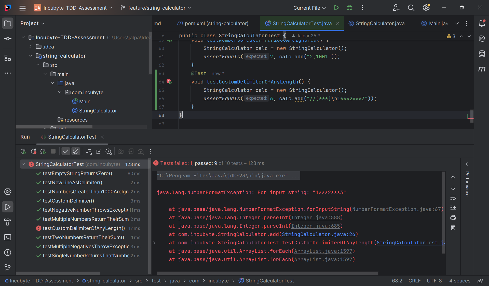
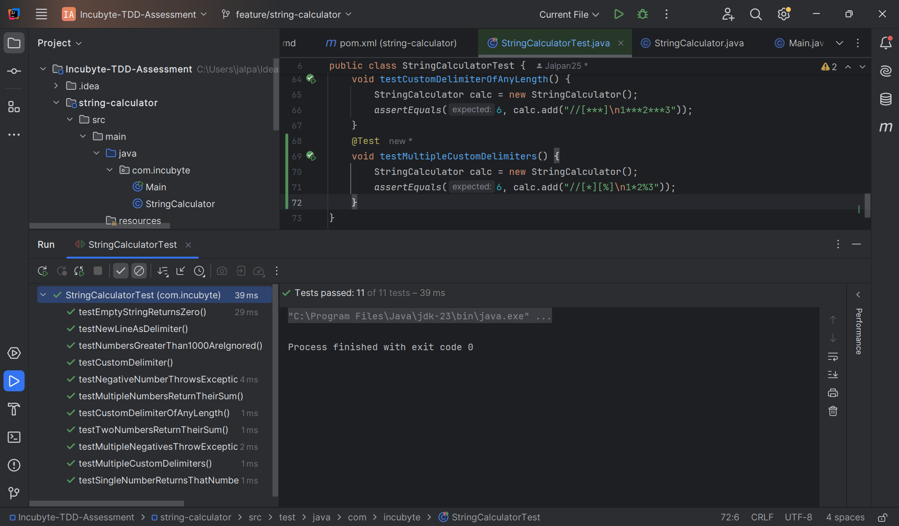

# Incubyte TDD Assessment – String Calculator

This project is part of the Incubyte campus recruitment process. It demonstrates the use of **Test-Driven Development (TDD)** practices to build a simple String Calculator.

---

## 🔧 Requirements Implemented

- ✅ Return 0 for an empty string
- ✅ Return the sum of one or two numbers (comma-separated)
- ✅ Handle unknown amount of numbers
- ✅ Allow newline (`\n`) as a delimiter
- ✅ Support custom single-character delimiter (`//;\n`)
- ✅ Throw exception for negative numbers (with all negatives listed)
- ✅ Ignore numbers greater than 1000
- ✅ Support custom delimiters of any length (`//[***]\n`)
- ✅ Support multiple custom delimiters (`//[*][%]\n`)
- ✅ Support multiple custom delimiters of any length (`//[**][%%]\n`)
- ✅ Maintain TDD principles in development (Red → Green → Refactor)

---

## 🧪 Tech Stack

- **Language**: Java 17+
- **Build Tool**: Maven
- **Testing Framework**: JUnit 5

---

## 🧠 TDD Commit Strategy

This project follows a strict TDD cycle:

1. **Red** – Add a failing test
2. **Green** – Implement the minimum code to pass
3. **Refactor** – Improve the code while keeping tests green

> 🔁 Each commit represents a single TDD step.

---

## 📸 Screenshots

See screenshots below showing test results and code snippets.

| Red Phase Example                 | Green Phase Example |
|-----------------------------------|---------------------|
|  |  |

---

## 📁 How to Run

```bash
# Compile and test the project
mvn clean test
